# Web Scraping Chatbot RAG

Professional modular Flask API for the Sports Chatbot.

## 🏗️ System Architecture

The project follows a modern **RAG (Retrieval-Augmented Generation)** architecture, split into three main pipelines:

```mermaid
graph TD
    subgraph DataPipeline [Ep 1: Data Ingestion]
        Scraper["🕷️ Scraper\n(Python 3.11 + Playwright)"] -->|Extracts| CSV["Raw Data\n(.csv)"]
        CSV -->|Processed by| Embedder["🧠 Embedding Model"]
        Embedder -->|Indexed into| FAISS[("🗄️ Vector Database\nFAISS/Chroma")]
    end

    subgraph Application [Ep 2: RAG Application]
        User(("👤 User")) <-->|Stunning UI| Frontend["💻 Frontend\n(React + Vite)"]
        Frontend <-->|API Request| Backend["⚙️ Backend API\n(Flask + LangChain)"]
        Backend <-->|Retrieve Context| FAISS
        Backend <-->|Generate Answer| LLM["🤖 AI Model\n(GPT-4o)"]
    end

    classDef pipeline fill:#f9f,stroke:#333,stroke-width:2px;
    classDef app fill:#bbf,stroke:#333,stroke-width:2px;
    class DataPipeline pipeline;
    class Application app;
```



### 1. Data Pipeline (Scraper)
-   **Engine**: Custom Python 3.11 script using `crawl4ai` (Playwright).
-   **Function**: Crawls YellowPages Thailand to extract business names, addresses, and details.
-   **Output**: Structured `.csv` files ready for embedding.

### 2. The Brain (Backend)
-   **Core**: Flask API serving as the orchestrator.
-   **Intelligence**: LangChain manages the RAG flow.
    -   **Router**: Decides if a user query is about "Sports", "Business Search", or "Chitchat".
    -   **Retrieval**: Searches the FAISS vector database for relevant businesses.
    -   **Synthesis**: Uses GPT-4o to generate a polite, human-like answer.

### 3. The Face (Frontend)
-   **Framework**: React + Vite (Fast & Modern).
-   **UI Library**: Tailwind CSS + Shadcn/UI for a premium, responsive look.
-   **Interaction**: Connects to the Backend via REST API.


## 🚀 Deployment

### Railway (Recommended)

1.  **Repo Structure**: Ensure your repo matches this folder structure.
2.  **Entry Point**: `run.py` (configured in `Procfile` as `run:app`).
3.  **Environment Variables**:
    *   `OPENAI_API_KEY`: Your OpenAI API Key.

The project is ready for one-click deployment on Railway using the included `Procfile`.

### Render (Free Tier Alternative)

Render offers a generous free tier for web services.

1.  **Sign up**: Go to [render.com](https://render.com).
2.  **New Web Service**: Connect your GitHub repository.
3.  **Settings**:
    *   **Runtime**: Python 3
    *   **Build Command**: `pip install -r requirements.txt`
    *   **Start Command**: `gunicorn run:app`
4.  **Environment Variables**:
    *   Add `OPENAI_API_KEY` in the "Environment" tab.


## 📁 Project Structure

```text
.
├── app/
│   ├── api/                 # API Routes
│   ├── agents/              # Intelligent Agents (Search, Knowledge, Router)
│   ├── core/                # Configuration (Env vars, Constants)
│   └── services/            # Integrations (LLM, VectorStore)
├── data/
│   ├── raw/                 # Original Excel data
│   └── vectorstore/         # FAISS Vector Index
├── frontend/                # React/Lovable Frontend Application
├── scraper/                 # (Ep 1) YellowPages Scraper
├── run.py                   # Application Entry Point
├── Procfile                 # Deployment Config
└── requirements.txt         # Dependencies
```

## 🛠️ Local Development

1.  **Create Virtual Environment** (Recommended):
    ```bash
    python3 -m venv venv
    source venv/bin/activate
    ```

2.  **Install Dependencies**:
    ```bash
    pip install -r requirements.txt
    ```

3.  **Run Application**:
    ```bash
    export OPENAI_API_KEY=your-key-here
    python run.py
    ```

4.  **Test API**:
    ```bash
    curl -X POST http://localhost:5000/chat \
      -H "Content-Type: application/json" \
      -d '{"message": "หาโยคะในกรุงเทพ"}'
    ```

## 💻 Frontend (React + Vite)

The frontend is located in the `frontend/` directory.

1.  **Navigate to folder**:
    ```bash
    cd frontend
    ```
2.  **Install dependencies**:
    ```bash
    npm install
    # or
    bun install
    ```
3.  **Run Locally**:
    ```bash
    npm run dev
    ```
    The app will open at `http://localhost:3000` (or similar).

## 🕷️ Scraper (Episode 1)

The logic for collecting the data is in the `scraper/` directory.
This enables the project to fetch fresh data from YellowPages to update the AI's knowledge base.

## 🚀 Deployment

### Backend (Render)
Already configured via `render.yaml`. Connect your repo to Render and it will auto-deploy.
- **Live URL**: `https://yellowpages-chatbot-api.onrender.com`

### Frontend (Vercel/Netlify/Lovable)
You can deploy the `frontend/` folder to Vercel, Netlify, or publish directly from Lovable.
