# Web Scraping Chatbot RAG

A production-ready RAG (Retrieval-Augmented Generation) chatbot for searching Thai businesses. Built with Flask, LangChain, FAISS, and GPT-4o.

---

## 🚀 Live Demo

**Try it here:** https://chat-thai-sport.lovable.app

**Note:** This is a demo deployment for portfolio purposes. For local setup and extended testing, see instructions below.

---

## 🏗️ System Architecture

The project follows a modular **RAG architecture** split into three pipelines:

### 1. Data Pipeline (Scraper)
* **Engine**: Python 3.11 + Playwright (`crawl4ai`)
* **Function**: Scrapes YellowPages Thailand for business data
* **Output**: Structured CSV files → Vector embeddings → FAISS index

### 2. Backend (Flask + LangChain)
* **Router Agent**: Classifies user intent (Business Search / Chitchat / Knowledge)
* **RAG Engine**: Retrieves relevant businesses from FAISS, generates responses with GPT-4o
* **Conversation Memory**: Maintains context across multiple messages
* **API**: RESTful endpoints for frontend communication

### 3. Frontend (React + TypeScript)
* **Built with**: [Lovable.dev](https://lovable.dev) - AI-powered frontend generator
* **Stack**: React 18 + Vite + TypeScript + Tailwind CSS + Shadcn/UI
* **Features**: Real-time chat, responsive design, premium UI components

```mermaid
graph TD
    subgraph DataPipeline [Episode 1: Data Ingestion]
        Scraper["🕷️ Scraper"] -->|Extracts| CSV["Business Data"]
        CSV -->|Embeddings| FAISS[("🗄️ FAISS Vector DB")]
    end

    subgraph Application [Episode 2: RAG Application]
        User(("👤 User")) <-->|Chat UI| Frontend["💻 React Frontend"]
        Frontend <-->|REST API| Backend["⚙️ Flask Backend"]
        Backend <-->|Retrieve| FAISS
        Backend <-->|Generate| LLM["🤖 GPT-4o"]
        Backend <-->|Context| Memory[("💭 Conversation Memory")]
    end
```



---

## 📁 Project Structure

```
web-scraping-Chatbot-RAG/
├── app/                    # Backend Flask application
│   ├── api/               # REST API routes
│   ├── agents/            # LangChain agents (Router, Search, Chat)
│   ├── core/              # Configuration
│   └── services/          # LLM and VectorStore integrations
│
├── data/
│   ├── raw/               # Scraped CSV files
│   └── vectorstore/       # FAISS vector index
│
├── frontend/              # React frontend (generated by Lovable)
│   ├── src/
│   │   ├── components/   # UI components
│   │   └── lib/          # Utilities
│   └── package.json
│
├── scraper/               # YellowPages web scraper
│
├── run.py                 # Backend entry point
├── Procfile              # Render deployment config
├── render.yaml           # Render service config
└── requirements.txt      # Python dependencies
```

---

## 🛠️ Local Development

### Prerequisites
- Python 3.11+
- Node.js 18+ (for frontend)
- OpenAI API Key

### Backend Setup

1. **Clone Repository:**
   ```bash
   git clone https://github.com/MossMojito/web-scraping-Chatbot-RAG.git
   cd web-scraping-Chatbot-RAG
   ```

2. **Create Virtual Environment:**
   ```bash
   python3 -m venv venv
   source venv/bin/activate  # On Windows: venv\Scripts\activate
   ```

3. **Install Dependencies:**
   ```bash
   pip install -r requirements.txt
   ```

4. **Set Environment Variable:**
   ```bash
   export OPENAI_API_KEY=your-openai-api-key-here
   # On Windows: set OPENAI_API_KEY=your-openai-api-key-here
   ```

5. **Run Backend:**
   ```bash
   python run.py
   ```
   Backend will run at: `http://localhost:5000`

6. **Test Backend (Optional):**
   ```bash
   curl -X POST http://localhost:5000/chat \
     -H "Content-Type: application/json" \
     -d '{"message": "หาโยคะในกรุงเทพ"}'
   ```

### Frontend Setup

1. **Navigate to Frontend:**
   ```bash
   cd frontend
   ```

2. **Install Dependencies:**
   ```bash
   npm install
   # or
   bun install
   ```

3. **Configure API URL:**
   
   Update the backend URL to point to localhost:
   - Find the API configuration file (usually in `src/lib/` or similar)
   - Change the API URL to `http://localhost:5000`

4. **Run Frontend:**
   ```bash
   npm run dev
   ```
   Frontend will run at: `http://localhost:3000` (or shown in terminal)

5. **Open Browser:**
   Navigate to the localhost URL and start testing!

---

## 🚢 Deployment

### Backend (Render)

The backend is deployed on **Render.com** with automatic deployments from GitHub.

**Setup:**
1. Connect GitHub repository to Render
2. Render uses `Procfile` and `render.yaml` for configuration
3. Add `OPENAI_API_KEY` environment variable in Render dashboard
4. Auto-deploys on every git push to main branch

### Frontend (Lovable)

The frontend was built using **Lovable.dev**, an AI-powered platform that generates production-ready React applications.

**How it works:**
- Lovable's AI generated the complete React + TypeScript application
- One-click deployment included with Lovable platform
- Updates can be made through Lovable's interface or by pushing code changes

**Alternative deployment:**
You can also deploy the frontend to Vercel or Netlify:
```bash
cd frontend
npm run build
# Deploy the dist/ folder to your preferred platform
```

---

## 🛠️ Tech Stack

**Backend:**
- Python 3.11
- Flask (Web framework)
- LangChain (RAG orchestration)
- FAISS (Vector database)
- OpenAI GPT-4o (LLM)
- OpenAI Embeddings (text-embedding-3-small)

**Frontend:**
- React 18 + TypeScript
- Vite (Build tool)
- Tailwind CSS (Styling)
- Shadcn/UI (Component library)
- TanStack Query (API calls)
- Lucide React (Icons)

**Infrastructure:**
- Render (Backend hosting)
- Lovable (Frontend hosting)
- GitHub (Version control)

---

## ✨ Key Features

- 🔍 **Semantic Search** - Vector-based similarity search with FAISS
- 🤖 **Intelligent Routing** - Classifies queries before processing
- 💬 **Conversation Memory** - Maintains context across messages
- 🇹🇭 **Thai Language Support** - Works with Thai and English
- ⚡ **Real-time Responses** - Fast retrieval and generation
- 📱 **Responsive Design** - Works on mobile and desktop

---

## 🕷️ Web Scraper (Optional)

To update the business data with fresh information:

1. Navigate to scraper directory:
   ```bash
   cd scraper
   ```

2. Run the scraper:
   ```bash
   python yellowpages_scraper.py
   ```

3. New data will be saved to `data/raw/`

4. Re-run the embedding process to update the vector database

---

## 📝 Environment Variables

**Required:**
- `OPENAI_API_KEY` - Your OpenAI API key for GPT-4o and embeddings

**Optional:**
- `FLASK_ENV` - Set to `development` or `production`
- `PORT` - Port number (default: 5000)

---

## 🎯 How It Works

1. **User sends a message** through the chat interface
2. **Router Agent** classifies the intent (Business Search / Chitchat / Knowledge)
3. **For business searches:**
   - Query is converted to vector embedding
   - FAISS retrieves top-5 most relevant businesses
   - GPT-4o synthesizes a natural response with the retrieved data
4. **Conversation memory** tracks context for follow-up questions
5. **Response** is displayed in the chat interface

---

## 🤝 Contributing

This is a portfolio project, but suggestions and feedback are welcome! Feel free to open an issue if you have ideas for improvements.

---

## 📄 License

This project is open source and available under the [MIT License](LICENSE).

---

## 🔗 Links

- **Live Demo**: https://your-app.lovable.app
- **GitHub**: https://github.com/MossMojito/web-scraping-Chatbot-RAG
- **Blog Post**: [Link to your Medium article]

---

## 📧 Contact

For questions or collaboration opportunities, please open an issue on GitHub or reach out via [your contact method].

---

**Built with ❤️ using Flask, LangChain, and GPT-4o**
